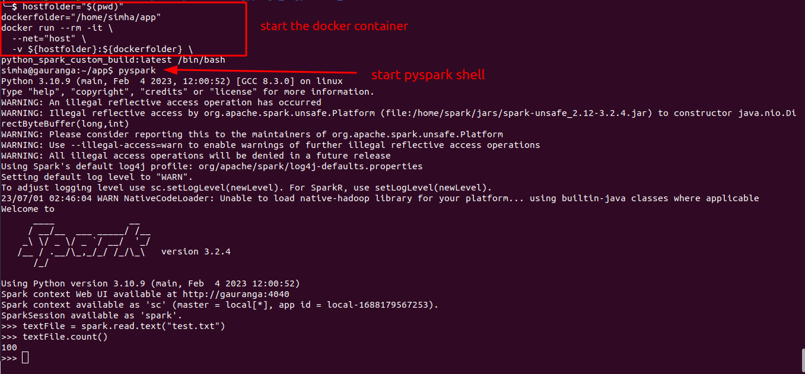
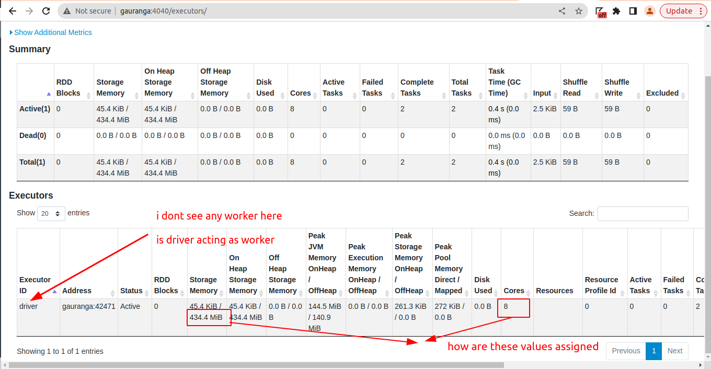

https://stackoverflow.com/questions/76593113/spark-application-run-inside-a-docker-container-i-see-only-driver-node-but-no

and step into the docker container

```
hostfolder="$(pwd)"
dockerfolder="/home/sam/app"
docker run --rm -it \
  --net="host" \
  -v ${hostfolder}:${dockerfolder} \
python_spark_custom_build:latest /bin/bash
```






Q1. I see there is only driver and no worked node. Can driver act as worker also

Q2: How to create a cluser within my container. I want to have a setup of 1 driver and 4 worker node in this container. So that parallelization can be achieved.

I am planning to use ECS task to run my spark scripts using docker containers. I dont want to use EMR or glue.

I am fine to have one node (acting as worker and driver) given that multiple executors are running so the parallelization is achieved.

My understanding is driver and executors are the core of paralleization. Irrespective of they run in seperate node or all together is one node


docker run --rm -it --net="host" -v "C:\Users\Sanjeet\Documents\git_pod\everything-docker\docker-spark":"/home/sam/app"  python_spark_custom_build:latest /bin/bash

"C:\Users\Sanjeet\Documents\git_pod\everything-docker\docker-spark"

docker run --rm -it --net="host" my-spark-docker :latest /bin/bash


docker run -p 4040:4040 --hostname localhost --rm -it --net="host" my-spark-docker:latest /bin/bash

WARNING: Published ports are discarded when using host network mode


docker run -p 4040:4040 --hostname localhost --rm -it my-spark-docker:latest /bin/bash


https://medium.com/@MarinAgli1/using-hostnames-to-access-hadoop-resources-running-on-docker-5860cd7aeec1
