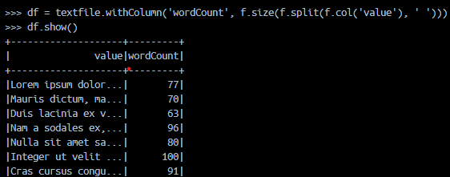

# Spark One Node setup in Docker

This is apache spark one node setup to test Apache spark and for learning purpose. This is an alternative to VM's that 
are big in volume and take too much resources. 

In order to start the Spark container you can run following command
This command uses dockerfile
```docker run -p 4040:4040 --hostname localhost --rm -it my-spark-docker:latest /bin/bash```

A more sophisticated command is given below which also mounts volume
```
hostfolder="$(pwd)"
dockerfolder="/home/sam/app"
docker run --rm -it \
  --net="host" \
  -v ${hostfolder}:${dockerfolder} \
python_spark_custom_build:latest /bin/bash
```

The Docker container can also be launched using docker-compose
```
    docker-compose up -d
```

In order to launch pyspark you can go to the container and type pyspark as given below


Test if spark is setup properly and working file by running below code

```
import pyspark.sql.functions as f

textfile_df = spark.read.text("textfile.txt")
textfile.show()
df = textfile.withColumn('wordCount', f.size(f.split(f.col('value'), ' ')))
df.show()
wc_df = textfile.withColumn('word', f.explode(f.split(f.col('value'), ' '))).groupBy('word').count().sort('count', ascending=False).show()
wc_df.show()
```




In order to launch SparkUI you can go to localhost:4040
Spark UI screenshot given below


For Windows:

```
set hostfolder=%cd%
set dockerfolder=/home/sam/app

echo %hostfolder%
echo %dockerfolder%

```

Reference:
https://stackoverflow.com/questions/76593113/spark-application-run-inside-a-docker-container-i-see-only-driver-node-but-no


Next Step: To setup spark cluster with multiple worker node. 
https://medium.com/@MarinAgli1/using-hostnames-to-access-hadoop-resources-running-on-docker-5860cd7aeec1
